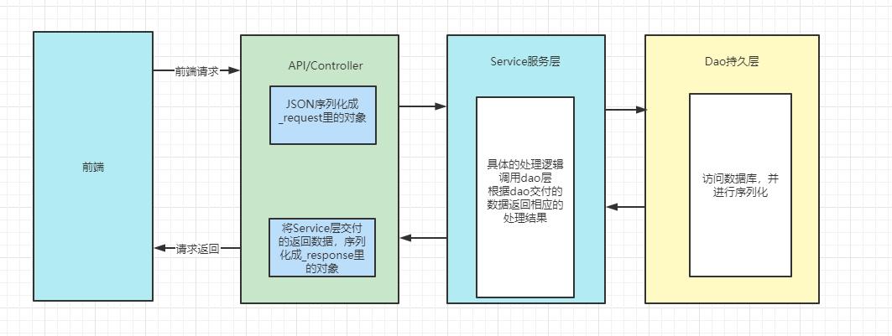
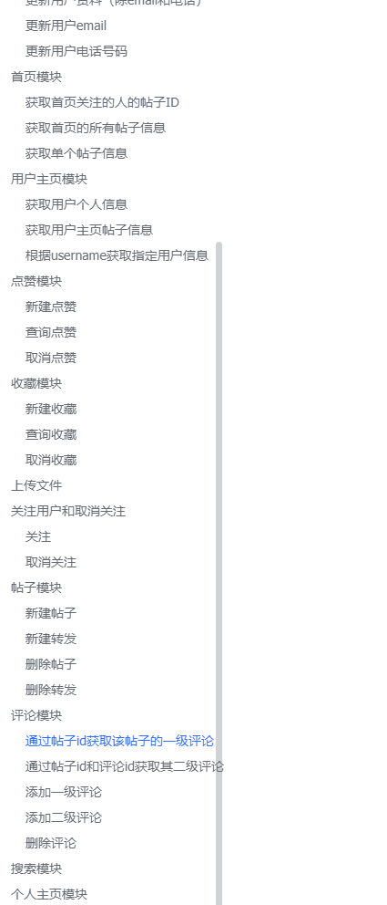
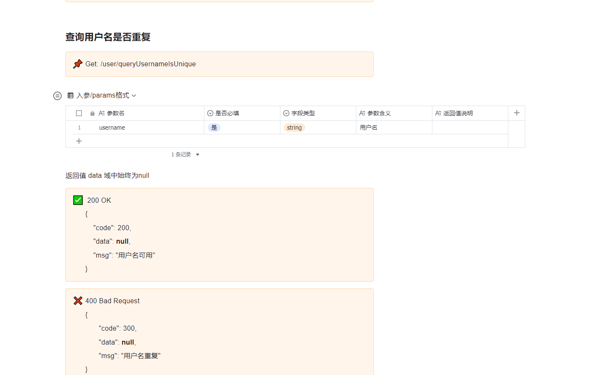

# Picture-Community


图片兴趣社区是一个类似于 Instagram 和微博的图片社交平台。

此项目为中国科学技术大学软件学院联合字节跳动的工程实践项目，仅作学习用途，不涉及任何商业用途。😄

- [后端项目仓库](https://github.com/picture-community-USTC-ByteDance/PictureCommunity)
  - v1版本 采用+++
  - v2新增+++

- [前端项目仓库](https://gitee.com/pseven7/image-community.git)
  - 采用+

## DEMO

[图片兴趣社区demo地址](http://49.235.120.114:3000/login)


## 项目启动

1. 修改 global/global.go

```go
//修改一下两项为
DbUrl   = "root:123456@(localhost:3306)/pic?charset=utf8mb4&parseTime=True&loc=Local"
ServerName = "localhost"
```

2.运行项目

```bash
cd PictureCommunity
go run main.go
```


## 结构

### 目录结构

```
PictureCommunity
├─controller           #controller层 用于接收http请求,序列化请求和返回参数
├─dao				   #dao持久层 所有具体mysql和redis操作
│  ├─firstpage
│  ├─post
│  └─user
├─entity              #实体类
│  ├─db               #数据库直接相关的表类
│  ├─_request         #入参
│  └─_response        #回参
├─global              #全局变量
├─initialize          #初始化
├─middleware          #中间件，例如token鉴权
├─response            #返回类型包装，包含返回成功、失败等格式
├─router              #http路由
├─service             #service层
├─utils               #工具类 jwt/雪花ID生产器 等
└─main.go             #main
```


### 项目部署架构


### 后端架构（经典MVC）




## API文档

包含设计框架、数据字典、API文档、逻辑结构等部分。

飞书链接：[图片兴趣社区开发文档](https://fsz0wa1bc2.feishu.cn/docs/doccn6xxmPKBcGfvGoYszNnuNDf)






## 作者&联系

**中国科学技术大学软件学院2021级图片兴趣社区团队**


**联系：**

- tanhuigen1101@mail.ustc.edu.cn
- 779183506@qq.com (前端)

